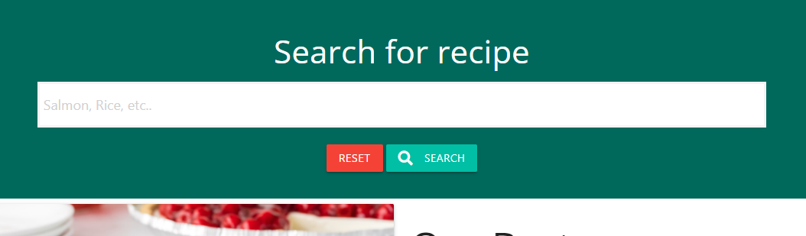

# Cooking-It Website 

[View the live project here.](https://cooking-it.herokuapp.com/)

This is the main website for Cooking-It. It is designed to be accessible and responsive for all different devices as well as functional for all types of different people wanting to have a place to enjoy and share their passion for food and cooking. 

## User Experience (UX)

## Strategy

The purpous of Cooking-It is to bring people with the love of food together and have a place where lots of different recipes are collected at one place to make it easy access finding inspiration. So it empovers the user to share their own recipes and have one single place to find recipes on, making it no longer neccessary to jump from website to website to find new knowledge in food and everything it has to offer. 

### Site Goals

* Make it easy for the user to find new recipes
* Provide an overview fo every type of recipe it has to offer
* Provide in debth information about particular recipes the user would like to explore 
* Easy access to upload your own recipes to share with others
* possibility to share their thoughts on a particular recipe by being able to add, read or remove comments

### User stories:
* First Time Visitor Goals
    * As a First Time Visitor, I want to easily understand the website and learn more about it's main purpose;
    * As a First Time Visitor, I want to be able to easily navigate throughout the site;
    * As a First Time Visitor, I want to search for different recipes;
    * As a First Time Visitor, I want to be able to register for Cooking-It;
    * As a First Time Visitor, I want an overall picture of what my own account can provide in addition to what is already available without a account;
    * As a First Time Visitor, I want to be able to add my own recipes;
    * As a First Time Visitor, I want to have the option to edit or delete my own recipes,
    * As a First Time Visitor, I want to able to logout.
* Returning Visitor Goals
    * As a Returning Visitor, I want the same application experience as a first time visitor;
    * As a Returning Visitor, I want to login to my own account;
    * As a Returning Visitor, I want to find new post of different recipes from other users;
    * As a Returning Visitor, I want to be able to read, add and/or delete comments. 
* Frequent User Goals
    * As a Frequent User, I want the same experience as a returning visitor;
    * As a Frequent User, I want to check to see if there are any newly added comments to my own or others recepies;
    * As a Frequent User, I want to give feedback by commenting recipes I have tried.

## Scope
Planned Features: 
* Responsive design;
* Navigation menu (wide as the site);
* MongoDB databases to store user/profile, recipes and comment information;
* CRUD functionality;
* Registerd users added recipes and management.
* Overiew of every recipe on the website;
* Comment section to either add, read or delete comments on,
* Profile page that can be deleted or editted;
* Login functionality;
* Logout functionality.

## Structure 

User Story: 

> As a First Time Visitor, I want to easily understand the website and learn more about it's main purpose.

Acceptance criteria:
* Landing page of Cooking-It stands for holding most of the information for the user visiting for the first time explaining everything there is to know before register. 

Implementation:
* A landingpage is provided to hold all information neccessary to explain the purpous of the website and guiding the user trough how everything works before register tho the website.

> As a First Time Visitor, I want to be able to easily navigate throughout the site.

Acceptance criteria:
* This made fairly easy mostly trough the navigation bar on top of the page, a smaler navigation in the fotter and buttons and links leading to different pages.

Implementation:
* The website holds a navigation fitting the full width of the screen on top of the page, simply designed to make it easy for the user to find different pages on the website. The user can also find links to two different pages on the bottom of the page in the fotter. The user will have buttons providing links to go back do different pages on the website but will also always be able to find the navigation if scrolling to the top of any page the user is exploring. Every page also holds a heading provided with the name for the page, making it more easy for the user to know exactly where they are on the website, worth noticing is that the navbar also is responive so if the user is on the phone it will just be to click on the hamburger to open all the menu options again. 

> As a First Time Visitor, I want to search for different recipes.

Acceptance criteria:
* It should be fairly easy for the user to search the database for recipes. 

Implementation:
* The user will find a search bar when visiting the recipes page that is styled to be easily seen on top of that page, also holding a heading telling the user what it actually is. The search bar is provided with functions that makes it possible to search by recipe name example pancakes or Super spinach pancakes to easily find what one is looking for. 

> As a First Time Visitor, I want to be able to register for Cooking-It.

Acceptance criteria:
* Easy access by navigation bar or on the landing page will guide the user to the registration. 

Implementation:
* On the landing page the user will find a button that asks if he or she want to register. The possibility to register will also be seen on the navigation if the user is not loged in already and if the instead pressed to login a link will be provided on the login page leading the user to the register page. 

> As a First Time Visitor, I want an overall picture of what my own account can provide in addition to what is already available without a account.

Acceptance criteria:
* Information will clearly describe everything on the landing page of the website as well on the profile page.

Implementation:
* The landing page will provide the user with information on what the user get if they create a account. The user will also see after it has registerd that some new pages is provided as soon as one is loged in, this can be seen for example on the navigation on top of the page providing new things as adding a recipe or logout. The user will also get more information about the website once loged in and landing on their profile that holds columns with information.

> As a First Time Visitor, I want to be able to add my own recipes.

Acceptance criteria:
* The user should easily find trough navigation or their profile their way to add a new recipe.

Implementation:
* The user will find in the navigation bar the option to add a recipe, meaning a page provided with a form that one must follow step by step to make a propper recipe. This link to this form will also be found under the users profile page presented as a button, providing as easy access as possible for the user to find it's own way to create a recipe. Once he or she has finished working on the recipe they can click on "Add recipe" and the will come back to the recipes page with a message telling them the recipe has been added. Lastly the user i provided a button/modal under the "Add New Recipe" that will give the user extra information about what they should think of before adding their recipe.

> As a First Time Visitor, I want to have the option to edit or delete my own recipes.

Acceptance criteria:
* It should be fairly easy for the user to find the edit or delete buttons provided on the recipes page.

Implementation:
* Once the user has added it's recipe they can either scroll on the recipes page or search for it by ingredient or name to then find that their recipes added now have buttons as delete or edit. Made to easily click that either if you clicked edit will take you back to the recipe form or if clicked delete will remove it for you confirmed on top of the page by a message telling the user your recipe has now been deleted. 

> As a First Time Visitor, I want to able to logout.

Acceptance criteria:
* It should be fairly easy for the user to log out of their own account.

Implementation:
* As the navigation on top of the page holds a lot of helping guidlines for the user, even here the user can find a button to be able to logout of the page(You can see it on the image of the navbar). Just by clicking on the logout button the user will sucessfully be loged out. Otherwise the user also can find the logout button on the bottom of their profile page. Making it extray easy to always find it's way out of the website. 

## Skeleton 

Below you find the wireframes: 

    -   Home Page Wireframe - [View](#)
    -   Mobile Wireframe - [View](#)
    -   Contact Us Page Wireframe - [View](#)

## Database Design

MongoDB Object format examples: 

**Collection users:** 
{ 
_id: ObjectId("60b5f9d66c1f8bdd0333189e") 
username: "Johnny" 
password: "pbkdf2:sha256:260000$1tL3PsthZn3Gvl17$3ee23af06ca10df454ae93a3a3fcc03f..." 
}
  
**Collection recipe:** 
{ 
_id: ObjectId("60b5f9d66c1f8bdd0333189e") 
category_name: "Dessert" 
recipe_name: "Our Best Cheesecake" 
recipe_description: "Not only is this our best cheesecake-a rich, creamy, cherry-topped sho..." 
recipe_ingredients: "1 ¾ cups HONEY MAID Graham Cracker Crumbs, ⅓ cup butter, melted, 1 ¼ c..." 
recipe_image: "https://images.unsplash.com/photo-1621955511667-e2c316e4575d?ixid=Mnwx..." 
recipe_servings: "4" 
recipe_time: "2 hours" 
recipe_method: "Heat oven to 350 degrees F, Mix graham crumbs, butter and 1/4 cup suga..." 
created_by: "tryuser" 
}
  
**Collection comments:** 
{ 
_id: "61966a07449d7a5b1f2faf" 
title: "Our Best Cheesecake" 
comment: "Really good " 
username: "tryuser" 
}

## Security 

Database connection details are set up in the env.py for development, in the case of security this is not uploaded to GitHub making sure the database and connectiondetails wont be visible for users. In production these are stored in Heroku.

## Surface

* Color Scheme
    * I wanted to keep the website light and airy with only a few accent colors following in the theam color Teal; some of the colors used:
        * For Navigation bar, fotter some text and buttons:
            * #80cbc4;
            * #004d40;
            * 00897b;
            * #00796b;
        * For elements that needed contrast:
            * #ef5350;
            * #004d40;
            * #fafafa;

* Typography
    * The main font used is Open Sans.

# Features

## Existing Features 
* User landingpage
* User registration
* User login
* Overview of recipes
* In detail page of single recipe 
* Create a new recipe
* Edit a added recipe 
* Delete a added recipe
* Comment section
* Create a new comment
* Delete comment
* User profile page
* User logout 

## Features left to implement
In my opinion ther is a lot that could be implemented to this website to make it even more fun an accessible for people, here you can find some of my thoughts for more possibilities:
* A rating function for all recipes making it easy to see how popular they are.
* A add to shoping list function, making it even more simple to shop for each recipe.
* A chat function to chat and cook together with friends from the website. 
* A friend request function. 
* Saving your own recipes on your profile, making less "hard" finding your own recipes if wanting to edit or delete them.
* Have a like button that could save all your liked recipes in your profile.
* Have all usernames presented with one capital letter.
* A search bar that you can search by ingredients in.

## Technologies Used

* [HTML5](https://en.wikipedia.org/wiki/HTML5)
    * This website has the HTML as the main language used to make a complete structure for the website. 
* [CSS3](https://en.wikipedia.org/wiki/Cascading_Style_Sheets)
    * This website use some custom css to perosonalize the style.
* [Materialize](https://materializecss.com/about.html)
    * Materialize was used create the base structure of the website, only a few custom css changes where made to personalize their layouts already existing. 
* [Materialize Icons](https://materializecss.com/icons.html)
    * I wanted easy access for me to build the webpage and so also materializes icons where used.
* [Google Fonts](https://fonts.google.com/)
    * Used to import some fonts to make the website even more easy to read. 
* [JavaScript](https://sv.wikipedia.org/wiki/Javascript)
    * A few lines of the JavaScript from Materialize vas implented to create functions as a parallax and dropdowns etc. 
* [jQuery](https://jquery.com/)
    * To support Materialize functionality.
* [Python3](https://sv.wikipedia.org/wiki/Python_%28programspr%C3%A5k%29)
    * The projects main core was created using Python.
    * Python modules used, they can also be found in the requirements.txt file:
    * click==8.0.3
    * dnspython==2.1.0
    * Flask==2.0.2
    * Flask-PyMongo==2.3.0
    * itsdangerous==2.0.1
    * pymongo==3.12.1
    * Werkzeug==2.0.2
* [MongoDB](https://en.wikipedia.org/wiki/MongoDB)
    * Was used to make the document based databases (collections), used to the store the data for this project.
* [Heroku](https://www.heroku.com/)
    * Heroku was used to deply this website and make it live. 
* [Git](https://git-scm.com/) 
    * Git was used for version control by the Gitpod terminal to commit to Git and push the code to Github. 
* [Github](https://github.com/) 
    * Github was used to store the project and it's code after being psuhed from Git.
* [Balsamiq](https://balsamiq.com/)
    * USed to create the wireframes for this website before starting to build it. 
* [Google Chrome Developer Tools](https://developers.google.com/web/tools/chrome-devtools)
    * This built in tool for developers were used constantly trough this development journey to inspect when something didn't work or looked right. 
* All code was written in the Gitpod Workspace 

## Testing

* [W3C Markup Validator:](https://validator.w3.org/)   No particular errors where found besides putting modal into a section instead of h3 tag. Some errors and warnings was caused due to Jinja syntax but beside that no errors or warnings were found. 

* [W3C CSS Validator](https://jigsaw.w3.org/css-validator/)  No errors were found.
* [jshint.com](https://jshint.com/)  No errors were found.
* [PEP8 Validator](http://pep8online.com/)  The check resulted in a a few errors. All of them said "line too long", as some of them were a bit longer than 79 characters, none of them exceeded the limit with 30 characters.

## Testing User Stories from User Experience (UX) Section

* First Time Visitor Goals
    * As a First Time Visitor, I want to easily understand the website and learn more about it's main purpose;
        * When the user lands on the landing page that is the home page he or she get easy informativ text that explains the vision of the website and what one would get if creating a account already here starting to navigate the user to make everything as clear as possible.
    * As a First Time Visitor, I want to be able to easily navigate throughout the site;
        * The user have several options to navigate trough the website either by the navigation bar on top, or by the buttons or links that is provided on all the different pages as well as some extra links on the fotter to make it easy for the user to always find the home page or the recipes. That will also make the user find the navigation bar again. 
    * As a First Time Visitor, I want to search for different recipes;
        * The search bar is made simple providing info of what it is by it's name above the search bar, and reset as well as search button. Still the user can search by pressing enter all to make it as simple as possible. When the user search he or she will either get some recipes presented or a text message telling no recipes were found.
    * As a First Time Visitor, I want to be able to register for Cooking-It;
        * Here the home/landingpage come in again, in it's text it present a button for registering that will lead the user to the register form. Or the user can register by clicking on it in the navigation bar. 
    * As a First Time Visitor, I want an overall picture of what my own account can provide in addition to what is already available
        * The landingpage provide some of the information for this, yet even the recipes page will do so. If the user click read more of one of the recipes they will find that a comment section is provided, yet no comments to be seen, here he or she could press the modal button to get more info of why they can't read any comments. Further more they will notice that thay can't add any recipes and that the landing page will explain why. Once the user is loged in more things will be visible and extra info is provided in their then available profile page.

## Further Testing

* The website was tested on Google Chrome and Safari 
* The website was viewed on several divices as laptop, mobile Iphone 8 not only by me but by others as well from their own device.
* The webiste was viewed on google chrome dev tools to see the overall responsiveness.
* Friends and family participated in testing the website to point out any issues. 

## Unfixed Bugs

* When running the code in the html validator some errors are still displayed these are due to the fact that it doesn't understand jinja and error like one for the index/home template that mention that I should implement lang="en" to my template is then to be ignored from me. This because the index template inherits code from the base template that holds the for example lang="en" tag. 
* I get some warnings in my app.py file telling me I have bad indentation. this I discussed with my mentor who said I would address this in my readme. The problem here is that I use a program that helps me with the indentation (sorry I do not remember what it is called) and no matter what I do when I change the indentation, everything jumps back when I save again thanks to this program. Therefore, I can do nothing but apologize for this and acknowledge myself well aware of the problem. 
* Last problem I would call it is regarding the comments the user can add. These are not found by the recipe id to put each comment for the right recipe instead found by the recipe name. yet I didn't have time enough to fix that problem and I am much aware of that this is not the best solution yet for now it at least show that I can work with the database where the comments are stored. 
* Another error in the app.py file is the 'env' imported but unused, this I also talked about with my mentor who had a discussion about this with another student, she recommended that i should change the code where get.env was used to getenv instead this didn't solve the problem and she recommended instead that I should leave it for now and make sure to mention it in this section of the read me. 

## Deployment to Heroku

Creation of application:

1. Go to the heroku.com website and login.
2. Click on the new button under dashboard.
3. Click select the create new app under the new button.
4. Enter the name of the app.
5. Select right region.

Set up the connection to Github Repository:

1. Click on the deploy tab and select Github - Connect to Github.
2. A prompt to find and connect your github repository will be displayed.
3. Type in your repository name and click search.
4. When the repo is found click on the connect button.

Set environment variables:

1. key: IP, value: 0.0.0.0
2. key: PORT, value: 5000
3. key: MONGO_DBNAME, value: (database name you want to connect to)
4. key: MONGO_URI, value: (mongo uri - This can be found in MongoDB by going to clusters > connect > connect to your application and substituting the password and dbname that you set up in the link).
5. key: SECRET_KEY, value: (This is a custom secret key set up for configuration to keep client-side sessions secure).

Enable automatic deployment: 

1. Once again click the deploy tab.
2. In automatic deploys section pick the branch you wish to deploy and then click Enable Automatin Deploys. 

# Credits 

Extra credit for the code institute lesson and mini project, I have not copied any of their code except for one regarding flash message on the base template under line 65. Here is the link to their lesson [Code Institute](https://github.com/Code-Institute-Solutions/TaskManagerAuth/blob/main/02-UserAuthenticationAndAuthorization/04-login_functionality/templates/base.html). On this line you will also find a comment providing the link to the lesson so that I won't take credit for it. 

I want to mention that non of the images is owned by me except for thos for the readme, all the images on the landing/home page are from the website [unsplash](https://cooking-it.herokuapp.com/). Other images provided for the recipes and added from friends and family testing the website are from different sources you could find if copying the img url. 
## Code 

## Sources and documentation used

* Several issues for this website was solved with the help of [slack](https://slack.com/) not only by search for similar resoults people have had before me but also to talk with friends who would like to help me understand some of my then going issues. Other issues were solved looking att the [W3Schools](https://www.w3schools.com) webiste, on the times when I needed to remind me of the basics. And the [Stackoverflow](https://www.stackoverflow.com) website who where a huge guidline whilst trying to solve validation errors. 
* [MongoDB](https://docs.mongodb.com/) documentation was constantly used throughout the whole project process.
* [Flask](https://flask.palletsprojects.com/en/2.0.x/) documentation was constantly used throughout the whole project process.
* [Python](https://docs.python.org/3/) documentation was constantly used throughout the whole project process.

## Acknowledgments

* Antonija Simic, my mentor who gave me support and much helpful feedback on my project,
* John Tutor, who took his time to help me solve a error with me note not for me,
* Nico Pauwels who helped me go trough a issue I had and took his time helping me understand how I could do to solve my issue and helping me understand how to write a readme in another way instead of how I have had before. 